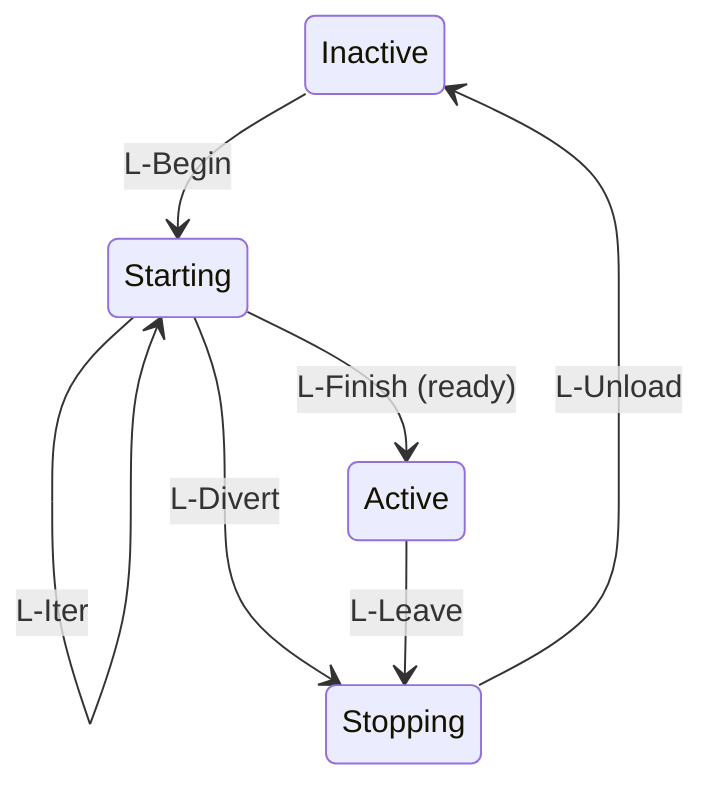

# MQTT Component Model

## Changelog

* 2026-09-09: Initial draft.

## Abstract

This EIP applies the component, dependency, effect, and recovery ideas from [A Programming Paradigm for Spatiotemporal Composability](https://arxiv.org/abs/2608.25512) to MQTT clients. It proposes an EMQX plugin and MQTT wire conventions for governing customer components. It does not change the architecture of EMQX itself.

A component declares which topic resources it provides and which topic resources it requires. The plugin validates those declarations, resolves dependencies, controls activation, and records the operations that must be reversed during cleanup.

The plugin governs resource identity and lifetime. It does not interpret application payloads or model the physical devices behind them.

## Motivation

### What the paper describes

The paper addresses dynamic composition along two dimensions. Temporal composability means that removing a component removes the effects it contributed to the managed context. Spatial composability means that a component declares what it requires from other components and reacts when those resources appear, disappear, or change provider.

The paper represents a component with three parts:

- A set of keys it requires.
- A set of keys it may provide.
- A sequence of context operations paired with inverse operations.

The runtime activates a component only when its required keys resolve. During activation, it records the concrete providers that satisfy those requirements and accumulates the inverses of the component's effects. When a requirement stops resolving, the runtime withdraws the component's provisions and executes its inverses. It keeps a departing provider available until its committed dependents finish cleanup when the provider is still reachable.

The paper does not derive inverses or prove arbitrary operations commutative. Resource authors define operations with valid inverses and ensure that effects performed by independent components do not interfere. The calculus then shows that dependency ordering, last-in-first-out recovery within a component, and commutativity between independent components preserve the managed context under dynamic activation and removal.

This framework retains that structure but places the managed context at the MQTT boundary instead of inside one process.

### Why MQTT is a useful boundary

Cordis mediates interactions through an in-process context object. For independently implemented IoT components, the MQTT broker is a natural equivalent boundary. Components already identify communication endpoints with topics, publish operations as messages, expose durable values as retained messages, and identify their runtime presence through authenticated connections.

The reserved topic namespaces give the paper's abstract keys concrete forms:

| Paper concept | MQTT representation |
|---|---|
| Key | A declared `$state/...`, `$service/...`, or `$reg/...` topic contract |
| Provision | An installed retained value, service handler, or registry handler |
| Dependency access | An authorized subscription or publication through a committed binding |
| Effect | A retained mutation, service operation, or registry entry |
| Inverse | Retained restoration, retained deletion, or service retraction |

Topics provide stable, language-neutral names. Publications separate an operation's transport from its application semantics. The plugin can therefore authenticate the caller, resolve the target provider, assign an effect identity, enforce confinement, and record cleanup while leaving the operation payload opaque.

This is a good boundary for effects visible through MQTT. It covers resource admission, broker-retained state, registrations, and operations implemented by cooperating providers. It does not cover unreported local state, out-of-band communication, or the physical world. A component receives the framework's guarantees only for interactions that pass through the managed namespaces and obey their contracts.

MQTT components appear, disappear, and change dependencies at runtime. A useful component framework must answer two questions:

1. Which components may run with the resources currently available?
2. Which effects must be removed when a component can no longer run?

Dependency declarations answer the first question. Activation-scoped inverse operations answer the second.

The core lifecycle rule is to separate logical availability from physical lifetime. When a provider starts leaving, the plugin immediately prevents new components from binding to it. Existing dependents retain their committed bindings while they stop and clean up. The provider removes its physical resources only after those dependents finish, when that remains possible.

### Why publications fit commutative effects

A key property that enables component composability in the paper is effect commutativity. Effects are operations on resources. Effects from independent components commute when changing their execution order does not change the observable result.

MQTT makes the independence of these operations apparent to component developers. Requests from different components arrive as separate publications rather than as calls within a shared execution flow. A developer can therefore see that their relative order must not be assumed and can design the resource to tolerate valid interleavings or make required ordering explicit in the resource contract.

Each publication is an immutable description of one action. Independently developed components can publish actions without sharing memory, object references, or direct connections.

For operations `A` and `B`, a service may promise:

```text
apply(A); apply(B)       ~= apply(B); apply(A)
retract(A); apply(B)     ~= apply(B); retract(A)
retract(A); retract(B)   ~= retract(B); retract(A)
```

The service then reaches an equivalent state regardless of how MQTT deliveries from different components are interleaved. The plugin processes metadata changes serially. Independent components may process application requests concurrently.

The model still imposes a causal order within one effect. The plugin sends `apply(E)` before `retract(E)` and never sends another `apply(E)` afterward. Commutativity governs interleavings between distinct effect IDs, not the two operations of one effect.

Examples include tagged set updates, identified counter deltas, independently identified registrations, and writes to disjoint map entries. A provider may publish the resulting materialized view separately through retained `$state/...` topics.

Publishing itself does not make an operation commutative. The service provider defines the operation algebra and promises the required laws. Absolute assignment, ordered-list insertion, and irreversible physical commands remain order-sensitive unless their contracts define suitable retraction and ordering semantics.

## Component states and transitions

Our version of the fiber calculus defines when an MQTT component may run and how the plugin cleans up its requests. The plugin state coordinator applies these rules to the component metadata. An activation uses a fixed selection of providers through setup, application work, and cleanup. A connected component may activate more than once.

The paper calls a runtime component instance a *fiber*. It separates orchestration rules, prefixed `O-`, from lifecycle rules, prefixed `L-`. We retain those rule names for reference. We call the paper's `Reloading` state **Starting** and its `Unloading` state **Stopping**. [Paper, sections 4.1–4.2](https://arxiv.org/pdf/2608.25512#page=31).

### Component states

| State | Meaning in the MQTT model |
|---|---|
| Inactive | The component has declarations but cannot send or accept new application requests. It waits for dependencies or administrative enablement. |
| Starting | The component initializes itself through managed requests to its selected providers and writes to its own resources. Its resources cannot satisfy other components' dependencies yet. |
| Active | The component may send and accept declared application requests. Its installed resources may satisfy dependencies. |
| Stopping | The plugin rejects new application requests from this activation. The component keeps its selected providers for cleanup. Its resources cannot satisfy new dependencies. |

These states describe a component after the plugin accepts its first SUBSCRIBE packet. Administrative enablement permits initialization once dependencies resolve. Readiness reports that initialization has completed during Starting.

The coordinator records two selections of providers. The **target view** selects a currently available provider activation for each dependency. No target exists when a required provider is missing or the component must not run. The **committed view** records the selection made when Starting begins. It remains fixed through cleanup. A change of provider requires a new activation, even when topic names and payloads stay the same.

### O-transitions: adding and retiring components

O-transitions handle external requests to add or retire components and the final removal of their records. They do not make dependencies available or perform cleanup. Both O-transitions and L-transitions run through the coordinator.

| Rule | MQTT model |
|---|---|
| `O-Insert` | Accept the first SUBSCRIBE packet and add the component's declarations in Inactive state. |
| `O-Retire` | Record that the component is leaving. Prevent another activation. Keep records needed for cleanup. |
| `O-Remove` | Remove the retired component's record after cleanup has completed and its provider bindings have been released. |

Retirement is permanent for that component. Temporary dependency loss does not retire it. A graceful departure requests retirement while the client remains connected for cleanup.

Disconnect removes the live component immediately. The coordinator retains any unfinished cleanup records. Removing those records is a separate step. A reconnect creates a new component and starts with a new declaration packet.

### L-transitions: activation and cleanup

L-transitions follow from the component's state and provider selection. The coordinator applies them when their conditions hold. A client's `ready` request reports completed initialization. The coordinator checks it before entering Active.



| Rule | Condition and action in the MQTT model |
|---|---|
| `L-Begin` | When a connected Inactive component is enabled, not retiring, and has all required providers, create an internal activation ID and commit those providers. Enter Starting and send `initialize`. |
| `L-Iter` | While the selected providers still match the target, process a managed initialization operation with its recorded cleanup action. Remain Starting. |
| `L-Finish` | When the component sends `ready`, check that initialization has completed and the selected providers still match the target. Enter Active, make installed resources available, and respond `activated` to the request. |
| `L-Divert` | When the target changes during Starting, stop initialization, enter Stopping, and send `deactivated`. Include accepted initialization operations in cleanup. |
| `L-Leave` | When an Active component loses its target or its selected providers change, enter Stopping and send `deactivated`. |
| `L-Unload` | After committed dependents finish cleanup, reverse this activation's recorded actions. Release its provider bindings and return to Inactive when cleanup completes. |

The plugin creates declaration subscriptions before Starting. Managed initialization operations begin only after `L-Begin`. During Active, accepted application requests continue to add cleanup records without changing the lifecycle state.

Entering Stopping withdraws resources from new use before cleanup removes them. A connected provider keeps the subscriptions needed by existing dependents until their cleanup completes. If an initialization operation completes after `L-Divert`, the plugin must include that work in cleanup. It must not activate the component using the old provider selection.

Each coordinator metadata update is atomic. Setup, MQTT delivery, and cleanup can take several updates. The coordinator must not treat sending a cleanup request as confirmation that cleanup completed.

### How the two kinds of transition interact

In this example, the switch and lamp are devices, each represented by a connected MQTT client. The switch depends on resources provided by the lamp.

When a switch submits its declaration packet, `O-Insert` records it as Inactive. If its lamp provider is unavailable, the switch waits. When the lamp becomes available, `L-Begin` starts an activation. The switch initializes through managed requests and sends `ready`. The coordinator performs `L-Finish` and responds `activated` to confirm that the switch is Active.

If the lamp leaves, the switch takes `L-Leave` and then `L-Unload`. The switch remains connected and can activate again when a provider becomes available. No new `O-Insert` is needed. If the switch itself leaves, `O-Retire` prevents reactivation. `O-Remove` follows completed cleanup.

## Design

### Terms and identities

| Term | Meaning |
|---|---|
| Component | A connected customer MQTT client participating in the framework |
| Component ID | Stable component type or logical name |
| Instance ID | Stable identity of one deployed component instance |
| Activation | One run with fixed provider bindings, including setup and cleanup |
| Activation ID | Internal identifier assigned at `L-Begin` and retained through cleanup |
| Resource key | A declared `$state`, `$service`, or `$reg` topic contract |
| Provider | The component that declares and installs a resource key |
| Dependent | A component that declares a requirement on a resource key |
| Provision | Authority to install a resource declared with `$provide/...` |
| Requirement | A dependency declared with `$consume/...` |
| Effect ID | Plugin-assigned identity of one managed service operation |

A component exists for one MQTT connection. Disconnecting removes the component and stops its application work. Reconnecting creates a new component, even when the client reuses the same component and instance IDs. These IDs name the component type and deployed instance. They do not preserve the component across connections.

The coordinator associates connection events with the component on that connection. An event from a disconnected component must not affect a new component. Cleanup records may remain after disconnect until cleanup finishes.

A component may stay connected through Inactive, Starting, Active, and Stopping. The coordinator assigns a new activation ID at each `L-Begin`. It uses that ID to track provider bindings, managed requests, and cleanup records. Internal completion events retain the ID of the activation that issued the work.

Clients do not need to send or interpret activation IDs. The plugin associates incoming requests with the current activation on the MQTT connection. Lifecycle messages are `initialize`, `ready`, `deactivated`, and `cleanup_complete`. The response to `ready` confirms activation.

### Plugin state coordinator

The plugin state coordinator stores and updates all component metadata for one tenant. The MQTT connection determines which coordinator handles an operation. The coordinator looks up components and their dependencies only within that tenant. Declarations and metadata records must not include tenant fields. Resource keys and topics must not include tenant prefixes.

The coordinator maintains:

- Component declarations, instance IDs, and MQTT connections.
- Component readiness, enabled status, and internal activation IDs.
- Resource declarations, installation status, availability, and dependencies.
- Available provider activations and the provider activations selected for each dependent.
- Registry membership and ownership of retained values and registry entries.
- Accepted service requests, request identities, cleanup actions, and cleanup progress.

MQTT connection handlers and plugin hooks send operations and events to the coordinator. The coordinator processes them one at a time. It checks each operation against the current metadata before updating it. The check and update are atomic, including updates that affect several components. Other operations see either the complete update or no change. A rejected operation leaves the metadata unchanged.

For example, the coordinator checks a service request against the connected component's current activation, declarations, and selected provider activation. It records the accepted request as part of the same atomic update. When the provider becomes unavailable, the coordinator marks its resources and affected dependents' resources as unavailable in one update. It also disables new application requests from affected activations in that update. Cleanup requests remain allowed. Cleanup includes service requests accepted before the update.

The coordinator records pending actions before the plugin forwards messages, changes retained messages, or runs cleanup. It handles completion and failure reports as later metadata updates. The atomicity guarantee applies to metadata updates. Message delivery and request execution follow the ordering and acknowledgement rules below.

### Declarations and confinement

The first SUBSCRIBE packet sent by a component declares its resources and dependencies. The client includes all declarations as topic filters in that packet. The virtual prefix `$provide/...` declares a resource provider. The virtual prefix `$consume/...` declares a dependency.

For example, a switch sends one packet:

```text
SUBSCRIBE
    $provide/service/switch/1
    $consume/state/lamp/1/contract
    $consume/service/lamp/1/control
    $consume/reg/lamp/1/controllers
    $consume/reg/lamp/1/controllers/#
```

The plugin records the declarations and creates subscriptions on the corresponding resource topics. The resource kind determines the subscription filters:

| Declaration filter | Actual subscription | Meaning |
|---|---|---|
| `$provide/state/X` | `$state/X` | Provide the retained value at `$state/X` |
| `$consume/state/X` | `$state/X` | Depend on and read `$state/X` |
| `$provide/service/X` | `$service/X` | Provide `$service/X` |
| `$consume/service/X` | `$service/X` | Depend on and send requests to `$service/X` |
| `$provide/reg/X` | `$reg/X/#` | Provide the registry `$reg/X` |
| `$consume/reg/X` | `$reg/X` | Depend on and register in `$reg/X` |
| `$consume/reg/X/#` | `$reg/X/#` | Depend on and observe `$reg/X` |

For `$provide/service/X`, the plugin also creates `$service/X/apply/+` and `$service/X/retract/+` subscriptions for the service protocol below. For `$provide/reg/X`, the plugin adds `/#` to the implicit subscription so the provider receives all registry entries. The declaration names the registry itself.

The virtual prefixes appear only in declaration filters. Clients publish application messages to `$state/...`, `$service/...`, and `$reg/...`. Subscribers receive messages on those resource topics.

The coordinator checks and records the declarations from the first packet together. Later SUBSCRIBE packets and publications must follow those declarations. They must not add resources or dependencies. A reconnect creates a new component with a new first SUBSCRIBE packet.

The confinement rules are:

- A component may install only resources declared with `$provide/...`.
- A component may use another component's resource only through a `$consume/...` declaration.
- The declaration determines the permitted operations on the resource.
- A component may not use a wildcard to escape its declared topic scope.
- A client may not publish to plugin-generated internal topics or reserved User Properties.
- Provider declarations for the same logical resource must not conflict or overlap unless the resource contract explicitly supports it.

One component provides each logical resource key. Multiple components may depend on that key. Exclusive provision does not imply that operations performed by those dependents commute.

### Declared, installed, and available provisions

A declared provision grants authority to provide a resource. It does not make that resource available.

A provision moves through three relevant states:

| State | Meaning |
|---|---|
| Declared | The first SUBSCRIBE packet includes a `$provide/...` filter for the key |
| Installed | The resource has its required subscriptions, handlers, or retained value |
| Available | The installed provision belongs to the current active provider activation and may satisfy requirements |

The installation condition depends on the resource kind:

- A `$state` value is installed when its retained message exists.
- A `$service` is installed when the plugin has created its apply and retract subscriptions and the provider has prepared its handlers.
- A `$reg` space is installed when the plugin has created its registry subscription and the provider has prepared its handler.

The plugin exposes an installed provision as available only when the component is Active. The component must have reported readiness and its hard requirements must still resolve to its committed providers.

### Topic model

| Namespace | Provider operation | Dependent operation | MQTT persistence |
|---|---|---|---|
| `$state/X` | Publish the retained value | Subscribe and read | Retained |
| `$service/X` | Subscribe to apply and retract operations | Publish an opaque command | Non-retained |
| `$reg/X` | Subscribe to registry entries | Register, observe, or both | Plugin-managed retained entries |

System lifecycle topics are separate from these resources. The client may include system-topic subscriptions in its first SUBSCRIBE packet. These subscriptions do not declare application resources. Sending `ready` or receiving its response neither provides nor requires an application resource.

The declaration filters create the subscriptions used by these operations. A successful subscription does not make the component active. The activation rules still apply.

### State resources

A `$state` resource exposes retained data owned by its provider.

```text
Provider P:
    First SUBSCRIBE: $provide/state/X
    PUBLISH RETAIN $state/X

Dependent C:
    First SUBSCRIBE: $consume/state/X
```

Only the provider may write, replace, or delete the retained message. A dependent may subscribe and read, but it may not write the topic merely because it requires the value.

The payload is opaque to the plugin. Typical values include configuration, a protocol contract, metadata, and reported state.

#### Reversal

The plugin treats an authorized retained mutation as a broker-side reversible effect:

```text
Forward: write retained message M at topic T
Inverse: restore the preceding retained message at T
         or delete T if no retained message preceded the write
```

The inverse restores the relevant MQTT application-message state, not only the payload. It must not restart an expired message's original expiry interval.

Repeated writes by one activation are reversed in last-in-first-out order. A stale inverse may not overwrite state belonging to a newer activation.

A retained write is reversible as broker state. It does not erase copies already delivered to subscribers or consequences produced from those copies.

### Service resources

A `$service` resource accepts operations from components that depend on its provider. In this model, each accepted command creates one activation-scoped effect.

The provider declares the service in its first SUBSCRIBE packet:

```text
Provider P:
    First SUBSCRIBE: $provide/service/X
```

The plugin creates subscriptions to `$service/X`, `$service/X/apply/+`, and `$service/X/retract/+`. The provider prepares handlers for apply and retract requests before reporting readiness.

The dependent publishes an opaque command to the logical base topic:

```text
Dependent C:
    First SUBSCRIBE: $consume/service/X
    PUBLISH $service/X
```

#### Apply

The plugin processes the base publication as follows:

1. Check that C is Starting or Active and has a committed binding to `$service/X`.
2. Allocate a fresh effect ID.
3. Record the effect ID, owner activation, and provider activation.
4. Suppress the base publication.
5. Forward the original payload to the provider's apply topic.

```text
Topic: $service/X/apply/<effect-id>
Payload: <original opaque command>
RETAIN: 0
```

The plugin must record the effect before forwarding it. Otherwise, a failure could leave an applied operation with no record from which to issue cleanup.

Each publication is a new effect unless the dependent supplies a request identity through an agreed property such as MQTT Correlation Data. A retry that represents the same logical request must reuse that request identity.

#### Retract

When the dependent explicitly releases the effect or the plugin cleans up its activation, the plugin publishes:

```text
Topic: $service/X/retract/<effect-id>
Payload: <empty>
RETAIN: 0
```

The empty payload is sufficient because the provider retains enough information to retract the effect by ID. The provider defines what retraction means for the application operation.

The plugin sends apply and retract for one effect from the same Erlang channel process to the same provider channel process. Erlang sender-to-recipient signal ordering therefore preserves:

```text
apply(E) < retract(E)
```

The provider processes those messages serially for the effect. The plugin never reuses an effect ID or emits another apply after retract. Recovery and journal replay must preserve the same causal order.

The provider implements this effect state machine:

```text
absent  -- apply(E)   --> applied
applied -- apply(E)   --> applied
applied -- retract(E) --> absent
absent  -- retract(E) --> absent
```

The last transition is an idempotent no-op for a duplicate retract or an apply that failed without creating an effect. It does not create a tombstone. An apply after retract is a framework protocol violation and is excluded by channel ordering and the plugin journal.

The required behavior is:

- Duplicate apply while the effect is active does not create another effect.
- Duplicate retract is harmless.
- Retract removes only the named effect.
- The provider may discard the effect record after retract completes.
- Application-level acknowledgements distinguish applied, retracted, failed, and unknown outcomes.

An MQTT acknowledgement confirms protocol progress. It does not confirm that the provider applied or retracted the operation.

#### Commutativity contract

For distinct effect IDs `E` and `F`, a composable service promises observational equivalence under reordering:

```text
apply(E); apply(F)       ~= apply(F); apply(E)
retract(E); apply(F)     ~= apply(F); retract(E)
retract(E); retract(F)   ~= retract(F); retract(E)
```

Apply and retract for the same effect do not commute. Their order is fixed by the per-effect causal guarantee.

The plugin cannot verify these laws because it treats operation payloads and provider state as opaque. The service author carries the same obligation that a coeffect provider carries in the paper.

A service that cannot provide these laws may still be useful, but it does not receive the framework's order-independent recovery guarantee. Physical effects may provide only compensation or a safe-state transition rather than exact reversal.

### Registry resources

A `$reg` resource is a retained registry space provided by one component and populated by components that depend on it.

```text
Registry provider P:
    First SUBSCRIBE: $provide/reg/X
```

The plugin creates the subscription `$reg/X/#` for the provider.

A dependent may request either or both access modes:

| Declaration filter | Access | Meaning |
|---|---|---|
| `$consume/reg/X` | `register` | Publish to `$reg/X` to maintain this activation's record |
| `$consume/reg/X/#` | `observe` | Receive the current registry entries on `$reg/X/#` |

Include both filters in the first SUBSCRIBE packet to register and observe. Both filters declare a dependency on the same registry provider. A `$consume/reg/X/#` declaration does not make the dependent a provider.

#### Registration

A dependent registers by publishing an opaque record to the virtual base topic:

```text
Dependent C:
    First SUBSCRIBE: $consume/reg/X
    PUBLISH $reg/X
    Payload: <opaque record>
```

The plugin validates the committed binding, suppresses the base publication, and materializes a retained entry:

```text
Topic: $reg/X/<dependent-instance>
Payload: <original opaque record>
RETAIN: 1
```

Only the plugin may publish or delete generated registry entries. A dependent cannot select another component's suffix. When replicas are possible, the suffix identifies the component instance rather than only its component type.

Republishing `$reg/X` during the same activation updates that activation's existing entry. If one activation may own several records, the plugin adds a record ID:

```text
$reg/X/<dependent-instance>/<record-id>
```

#### Registration reversal

The registration is a broker-side reversible effect:

```text
Forward: create the retained entry owned by activation A of dependent C
Inverse: delete that entry if it is still owned by activation A of dependent C
```

The ownership check prevents cleanup from an old activation from deleting a replacement activation's entry at the same stable topic.

Different dependents occupy different entries. Their registration, update, and removal operations therefore do not interfere:

```text
register(A); register(B) ~= register(B); register(A)
remove(A); register(B)   ~= register(B); remove(A)
```

This is the paper's table-of-registrations pattern. The registry provider owns the table contract. Each dependent activation owns one independently removable entry inside it.

#### Observation and membership

The plugin subscribes dependents with `$consume/reg/X/#` declarations to the generated entries. Observation alone creates a dependency on the registry provider, not on every component that owns an entry.

A component that requires particular members must declare a membership condition separately. Examples include an exact set of instance IDs, at least `N` entries, or another contract-defined predicate. The plugin records the selected member activations in the component's committed view.

The declaration filters above do not encode membership conditions. Their encoding in the first SUBSCRIBE packet remains to be defined.

### Dependency resolution

The plugin maintains two views for each activation:

- The target view selects an available provider activation for each dependency. No target exists when the component is disabled or retiring, or lacks a required provider.
- The committed view contains the provider activations selected at `L-Begin`. It remains fixed until cleanup completes.

A component activates only when each hard requirement resolves according to its contract. The committed view records provider activation identities, not only logical topic names or payloads.

Provider replacement changes the binding even if the new provider uses the same topics and publishes identical values. The default response is to deactivate the old consumer activation and create a new activation with fresh bindings.

The hard dependency graph must be acyclic. The `$consume/...` filters above declare hard dependencies. The encoding of soft or advisory dependencies remains to be defined.

### Component self-initialization

The component initializes itself during Starting. At `L-Begin`, the coordinator commits the selected providers. The plugin sends an `initialize` notification on a system topic. The component may then issue managed initialization operations.

Each initialization operation is an `L-Iter` step. It uses the same declarations, provider bindings, and cleanup rules as an operation during Active:

| Initialization operation | Required declaration | Recorded cleanup |
|---|---|---|
| Send a request to `$service/X` | `$consume/service/X` | Retract the accepted request through the selected service provider |
| Publish a retained value to `$state/X` | `$provide/state/X` | Restore the preceding retained message or delete the new value |
| Publish a registration to `$reg/X` | `$consume/reg/X` | Delete the entry owned by this activation |

The coordinator records each operation's owner and cleanup action before the plugin forwards the request or changes retained data. These records belong to the activation that began at `L-Begin`. Cleanup runs in reverse order when the actions do not commute. Initialization can change retained values and registry entries before the component becomes Active. Those changes do not make its provided resources available to dependents.

For a registration, the dependency is on another component's registry. The new entry belongs to the initializing component's activation. Creating that entry does not make the component a provider of the registry.

#### Completing initialization

After initialization completes, the component publishes a non-retained `ready` request to the system topic for readiness. It tells the coordinator that the component has finished its initialization operations and prepared its declared handlers and retained values. The component waits for the response to this request.

The component must wait for the initialization results it needs before sending `ready`. For service requests, use the application-level acknowledgements required by the service contract. An MQTT acknowledgement alone does not confirm that the provider completed a request.

The coordinator checks that the connected component is still Starting. It also checks that initialization operations have completed, declared resources are installed, and the selected providers still match the target. It then performs `L-Finish` and responds `activated` to the `ready` request. The component's installed resources can now satisfy dependencies. If a check fails, the plugin returns an error response with the reason. A rejected request does not perform `L-Finish`.

The `activated` response confirms activation at the application level. It is the successful response to `ready`, not a separate notification. It is separate from the MQTT acknowledgement of the request publication.

The plugin retains initialization cleanup records throughout Active. It uses them when the activation later stops. Each new activation runs initialization again and sends its own `ready` request.

#### Interrupted initialization

When a dependency disappears or changes during initialization, the coordinator takes `L-Divert`. The plugin sends a `deactivated` notification on the component's system topic. This notification tells the component that initialization has stopped, even though it never reached Active.

On receiving `deactivated`, the component must stop initialization and cancel pending local work. It must not send further initialization operations or `ready`. It performs its local cleanup and reports `cleanup_complete`.

The coordinator rejects further initialization operations as soon as it enters Stopping. It does not wait for the component to receive the notification. Cleanup includes accepted service requests, retained writes, and registry entries. It preserves the per-request apply-before-retract order.

The coordinator rejects `ready` unless the component is Starting. A late operation result still belongs to the activation that issued it. Disconnect removes the component, but the plugin keeps the records needed to clean up its initialization.

### Readiness and lifecycle

Each component maintains a system-topic subscription for lifecycle notifications. System topic names are separate from application resources and remain available while the component is inactive.

The control messages use system topics:

```text
Plugin -> component: initialize
Component -> plugin: ready (request)
Plugin -> component: activated (response to ready)
Plugin -> component: deactivated
Component -> plugin: cleanup_complete
```

`initialize` permits the component to begin managed initialization using its committed providers. `ready` reports that initialization has completed. The coordinator checks dependency availability itself.

The conditions for `L-Begin` are:

```text
component is connected and Inactive
and all hard requirements are available
and the component is administratively enabled
and the component is not retiring
```

The component does not send `ready` before `L-Begin`. The plugin responds `activated` to `ready` only after completing `L-Finish`.

`deactivated` means that the component must stop accepting or initiating new application requests. Cleanup requests remain allowed. It does not mean that cleanup has completed.

The coordinator associates lifecycle messages with the MQTT connection and the component's current state. Before sending `cleanup_complete`, the component must finish or cancel its previous initialization and stop sending requests from that work. The coordinator waits for cleanup to complete before sending another `initialize`.

### Withdrawal and cleanup ordering

Logical withdrawal must happen before destructive cleanup.

For a dependency chain:

```text
scene -> switch -> lamp
```

where the arrow means "depends on," loss of the lamp produces this sequence:

1. Remove the lamp from the target view so no new activation can acquire it.
2. Withdraw the switch and scene provisions from new use.
3. Deactivate and clean up the scene.
4. Deactivate and clean up the switch.
5. Finish destructive cleanup of the lamp, if it is still reachable.

The ordering concerns cleanup completion, not only notification order. A provider keeps its service and registry subscriptions available to committed dependents while they retract service effects and remove registry entries.

If a provider disconnects before cleanup finishes, the plugin cannot preserve it for cleanup. The plugin still withdraws it, rejects further operations from affected activations, reverses broker-owned effects, and records client-side cleanup as failed or unknown where necessary.

### Effect classes

| Forward effect | Recorded inverse | Executor |
|---|---|---|
| Write `$state/X` retained message | Restore or delete the preceding retained message | Plugin |
| Apply `$service/X` effect | Publish `$service/X/retract/<effect-id>` | Plugin and service provider |
| Create `$reg/X` entry | Delete the activation-owned retained entry | Plugin |
| Create service or registry subscription from a declaration | Remove the subscription after dependent cleanup | Plugin |
| Perform a physical action | Contract-defined compensation or safe-state action | Device or service provider |

Effects within one activation are reversed in last-in-first-out order when they do not otherwise commute.

The lifecycle supplies ordering between a provider's installation and its dependents' use. Operations performed by sibling dependents on one service must commute, be isolated, or accept a weaker guarantee. The framework does not repair an arbitrary noncommutative operation.

### Authorization matrix

| MQTT operation | Required declaration or authority |
|---|---|
| Publish retained `$state/X` | `$provide/state/X` |
| Subscribe `$state/X` | `$provide/state/X` or `$consume/state/X` |
| Subscribe `$service/X` | `$provide/service/X` or `$consume/service/X` |
| Subscribe `$service/X/apply/+` and `retract/+` | `$provide/service/X` |
| Publish `$service/X` | `$consume/service/X` through a committed binding |
| Publish internal service apply or retract topics | Plugin only |
| Subscribe `$reg/X` | `$consume/reg/X` |
| Subscribe `$reg/X/#` as registry owner | `$provide/reg/X` |
| Publish `$reg/X` | `$consume/reg/X` through a committed binding |
| Subscribe `$reg/X/#` as observer | `$consume/reg/X/#` |
| Publish generated `$reg/X/...` entries | Plugin only |

The plugin checks authorization against the connected component, current activation, declarations, and committed provider binding.

Starting components may issue the managed initialization operations described above. Active components may continue to use those operations. Inactive components must not issue them. Stopping components may perform only cleanup operations.

### Core invariants

The model depends on these invariants:

1. At most one activation is current for an instance.
2. A connected Starting component may issue managed initialization operations. Only a connected Active component may make its resources available to dependents.
3. A component accesses only resources and operations allowed by its first SUBSCRIBE packet.
4. A declared provision is not selectable until it is installed and its provider is active.
5. Every dependent activation binds to concrete provider activations.
6. Withdrawal from the target view precedes destructive cleanup.
7. A graceful provider remains available to committed dependents until their cleanup completes.
8. Every accepted service operation has a unique effect ID and an owning activation.
9. Apply precedes retract for each effect, and the plugin never sends apply afterward.
10. Retracting an absent effect is an idempotent no-op.
11. Every generated registry entry has one owning dependent activation.
12. Cleanup from an old activation cannot remove state belonging to a replacement activation.
13. Service commutativity and retraction laws are explicit provider obligations.
14. The coordinator checks and updates component metadata atomically, one operation at a time.

### Guarantee boundary

The plugin can strongly govern broker-owned state and admission:

- It can reject undeclared or stale operations.
- It can prevent new bindings to a withdrawn provider.
- It can restore or delete managed retained messages.
- It can delete managed registry entries.
- It can issue every recorded service retraction.

The plugin cannot erase an MQTT message already delivered or a physical consequence already produced. A service retraction establishes the recovery behavior promised by that service. It does not make physical history equivalent to a history in which the operation never occurred.

MQTT delivery also introduces duplicates, loss according to QoS, and interleaving among different effects. Effect IDs, request identities, idempotence, per-effect channel ordering, and application-level acknowledgements address these conditions. A reconnect creates a new component. Pending events and cleanup from the disconnected component must not affect it. MQTT Wills provide failure signals; they do not execute cleanup.

The strongest framework guarantee is:

> When a provision is withdrawn, no new activation can acquire it. Existing dependents stop accepting or initiating new application requests. They clean up through their committed bindings. The plugin reverses its broker-owned effects and issues each recorded service retraction without allowing stale activations to affect their replacements.

### Example

A lamp sends this first SUBSCRIBE packet:

```text
SUBSCRIBE
    $provide/state/lamp/1/contract
    $provide/service/lamp/1/control
    $provide/reg/lamp/1/controllers
```

A switch sends this first SUBSCRIBE packet:

```text
SUBSCRIBE
    $consume/state/lamp/1/contract
    $consume/service/lamp/1/control
    $consume/reg/lamp/1/controllers
```

The lamp publishes its retained contract, receives control operations, and consumes activation-scoped controller records. The switch reads the contract, publishes opaque control operations, and maintains its plugin-generated controller entry.

If the switch deactivates, the plugin retracts its control effects and deletes its registry entry. If the lamp begins a graceful shutdown, the plugin first prevents new switches from binding, then deactivates existing switches, waits for their retractions and registry removal, and finally removes the lamp's subscriptions.

The lamp defines the physical meaning of control and retraction. The plugin does not choose a default lamp state or simulate the lamp.

### Mapping to the paper

| Paper term | MQTT component model |
|---|---|
| Key | Logical `$state`, `$service`, or `$reg` resource contract |
| Component | Customer MQTT component |
| Fiber | A component runtime record that can pass through several activations |
| Coeffect specification | Dependencies declared with `$consume/...` |
| Provision | Declared and installed topic resource |
| Coeffect operation | State access, service apply/retract, or registry registration |
| Revertible effect | Managed operation paired with restore, delete, or retract |
| Target view | Provider activations selectable now |
| Committed view | Provider activations bound to one current activation |
| Confinement | Topic authorization based on declarations and current activation |
| Recovery | Dependency-ordered cleanup and inverse execution |

The paper's inverse and commutativity witnesses are runtime contract obligations here. The plugin enforces identities, access, bindings, and ordering. Resource authors define the application semantics that make their opaque operations retractable and commutative.

## Configuration Changes

TBD.

## Backwards Compatibility

TBD.

## Document Changes

TBD.

## Testing Suggestions

TBD.

## Declined Alternatives

TBD.
